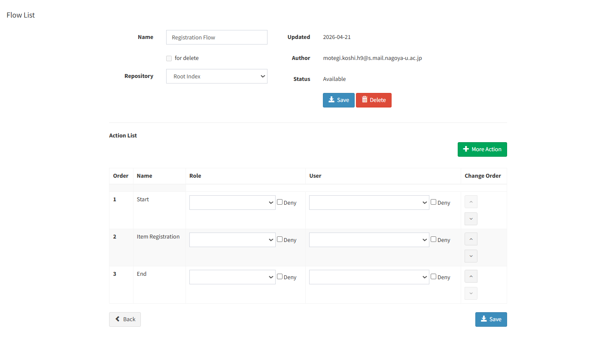
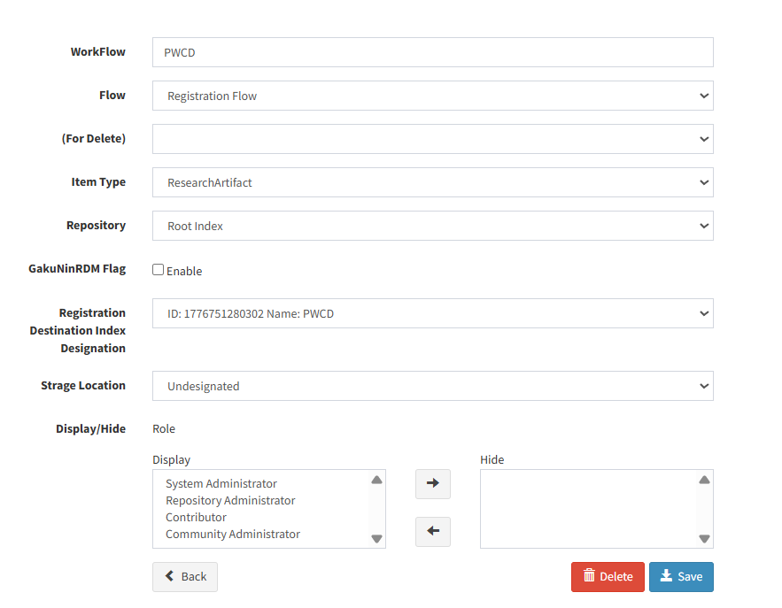

# weko3-metadata-registrar

WEKOのItem TypeエクスポートとCSV/TSV形式のソースデータから、メタデータ一括登録用のTSVまたはZIPを生成し、SeleniumでWEKOへ登録するツールです。

## 0. 利用の流れ

0. Item Typeの項目名に合わせたCSV/TSVを準備する
1. 初期設定を行う
2. WEKOインポート用ZIPを生成する
3. 生成したZIPをSeleniumでWEKOへ登録する

コマンドは、特に記載がない限りリポジトリルートで実行します。

(0のファイルは各自でメタデータを収集してください。形式は[サンプルファイル](./sample/sourcedata_sample.tsv)をご参照ください。)


## 1. 初期設定

### 前提条件

- Python 3.13
- [uv](https://docs.astral.sh/uv/)
- Google Chrome（Selenium登録を行う場合）
- Item TypeをエクスポートできるWEKO環境と権限
  - (GitHub上で公開されている[WEKO3](https://github.com/RCOSDP/weko.git) 2.0.0で動作を確認しています。JAIRO Cloudや他のバージョンでの動作は確認していません。)


依存パッケージをインストールします。

```shell
uv sync
```

### Item Type の設定（インポート・エクスポート）

WEKO内でAdministration > Item Types > Metadataに移動し、Item Typeを設定してください。

同梱の `sample/config/ItemType_export_sample.zip` は設定例です。WEKOにインポートして、設定ファイルとして利用できます。


別の項目を設定する場合は、Item Typeの設定を行ったうえで、sample/configのZIPファイルをエクスポートしたZIPへ置き換えてください。（あるいは、configの中で、参照先のファイルパスを変更してください。）


### Index Tree の設定

WEKO内でAdministration > Index Tree > Edit Treeに移動し、Index Treeの設定を行ってください。
（詳細は省略します。公式のドキュメントをご参照ください）

### Workflow の設定

WEKO内でAdministration >  WorkFlow > FlowList・WorkFlow Listに移動し、WorkFlowを設定してください。
以下が設定例です。




### 設定

[config/metadata_registration.json](config/metadata_registration.json) に、対象WEKOとItem Typeに対応する値を設定します。

```json
{
  "weko_base_url": "https://weko.example.org",
  "item_type_export": "../sample/config/ItemType_export_sample.zip",
  "indexes": {
    "Example": "1234567890"
  },
  "default_index": "Example",
  "publish_date": "2025-05-27",
  "default_languages": {
    "Title": "en",
    "Title_g": "en"
  }
}
```

| キー | 必須 | 用途 |
|---|---:|---|
| `weko_base_url` | 必須 | Item Schema URLの生成とSelenium登録先の既定値 |
| `item_type_export` | 必須 | WEKOからエクスポートしたItem Type のZIPファイルへのパス |
| `indexes` | 必須 | Index名をキー、IndexIDを値とする対応表 |
| `default_index` | 必須 | `--index-name`（後述） を省略した場合に使用するIndex名 |
| `publish_date` | 必須 | `--publish-date`（後述） を省略した場合に使用する公開日（`YYYY-MM-DD`） |
| `default_languages` | 必須 | 言語子項目へ設定する既定値を、入力列名ごとに指定するオブジェクト |

`Index` はメタデータの登録先となるWEKO上のコレクションです。対象WEKOのIndex管理画面で登録先のIndex名とIndexIDを確認し、`indexes` に設定してください。
（メタデータの登録結果（[例](./sample/ResearchArtifact(40001).tsv)や、ワークフローの設定画面から確認できます）

`item_type_export` の相対パスは、`metadata_registration.json` があるディレクトリを基準に解決されます。`default_index` には、`indexes` に存在する名前を指定してください。

### 認証情報

Selenium登録を行う場合は、`.env.sample` をリポジトリルートの `.env` へコピーします。

macOS/Linux:

```shell
cp .env.sample .env
```

PowerShell:

```powershell
Copy-Item .env.sample .env
```

`.env` の値を対象WEKOのアカウントに変更します。

```dotenv
WEKO_EMAIL=<login-email>
WEKO_PASSWORD=<login-password>
```

### 入力CSV/TSV

入力ファイルの列名は、Item Type ZIP内のメタデータ項目名と一致させます。次の例は、同梱されているサンプルItem Typeに対応するもので、すべてのItem Typeに共通する列名ではありません。

```csv
corpusid,Title,Title_g,Creator,PublicationYear_g
123,Main title,Alternative title,"['Alice', 'Bob']",2026-08-23T12:34:56
```

サンプルファイルは[こちら](./sample/sourcedata_sample.tsv)

## メタデータファイルの生成

### 基本コマンド

次の例では、50レコードごとに分割したWEKOインポート用ZIPを `output/zip_data` へ生成します。

```shell
uv run python src/scripts/generate_metadata_imports.py \
  --input path/to/input.csv \
  --output-dir output/zip_data \
  --chunk-size 50 \
  --zip
```

### 生成コマンドの引数

| 引数 | 必須 | 既定値 | 説明 |
|---|---:|---|---|
| `--input PATH` | 必須 | なし | ソースCSV/TSV |
| `--output-dir PATH` | 必須 | なし | 生成ファイルの出力先 |
| `--registration-config PATH` | 任意 | `config/metadata_registration.json` | 登録設定JSON |
| `--index-name NAME` | 任意 | 設定の `default_index` | 使用するIndex名。IndexIDは `indexes` から解決する |
| `--publish-date YYYY-MM-DD` | 任意 | 設定の `publish_date` | 公開日を一時的に上書きする |
| `--chunk-size N` | 任意 | `0` | 1ファイル当たりのレコード数。`0` は分割しない |
| `--zip` | 任意 | 無効 | TSVに加えて登録用ZIPを生成する |
| `--keep-tsv` | 任意 | 無効 | `--zip` 使用時もZIP化前のTSVを残す |

`--zip` を指定しない場合はTSVだけを生成し、TSVは常に残ります。`--zip` を指定して `--keep-tsv` を指定しない場合、TSVはZIPへ格納した後に削除されます。

`--chunk-size`は一括登録時のエラー回避のためのものです。[v1.0.8の修正](https://nii-auth.atlassian.net/wiki/spaces/JAIROCloudWEKO3/pages/43549582/2025-07-02+v1.0.8)によって改修されたと思われますが、設定する事をお勧めします。

### 出力ファイル

| 条件 | TSV | ZIP |
|---|---|---|
| 分割なし | `output_write.tsv` | `import.zip` |
| 分割あり | `output_write_001.tsv` など | `import_001.zip` など |

ZIP内ではTSVを `data/output_write[_NNN].tsv` として格納します。入力にレコードがない場合、ファイルは生成されません。生成TSVはWEKOのインポート形式に合わせてUTF-8 BOM付きで出力されます。


## WEKOへの登録

### 登録前の確認

- `.env` の `WEKO_EMAIL` と `WEKO_PASSWORD` が対象環境の値である
- `output/zip_data` に今回登録するZIPだけが置かれている

生成時のItem Schema URLには、登録設定の `weko_base_url` が常に使われます。一方、Seleniumの登録先URLは次の優先順位で決まります。

```text
--weko-base-url
  > 実行プロセスの環境変数 WEKO_URL
  > .env の WEKO_URL
  > metadata_registration.json の weko_base_url
```

CLIまたは `.env` でURLを上書きする場合は、生成時と登録時が異なるWEKO環境になっていないことを確認してください。

### 基本コマンド

Chromeを表示して登録します。

```shell
uv run python src/scripts/selenium_auto_register.py
```

Chromeを画面に表示せず実行する場合は、`--headless` を指定します。

```shell
uv run python src/scripts/selenium_auto_register.py --headless
```

既定では `output/zip_data` 内のすべてのZIPをファイル名順に登録します。

### 登録コマンドの引数

| 引数 | 既定値 | 説明 |
|---|---|---|
| `--base-dir PATH` | リポジトリルート | `.env` と既定入出力ディレクトリの基準 |
| `--weko-base-url URL` | 環境変数、`.env`、または登録設定 | Seleniumの登録先URLを一時的に上書きする |
| `--registration-config PATH` | `config/metadata_registration.json` | 登録設定JSON |
| `--selector-config PATH` | `config/weko_ui_selectors.json` | WEKO画面のUIセレクタ設定 |
| `--zip-dir PATH` | `output/zip_data` | 登録対象ZIPのディレクトリ |
| `--download-dir PATH` | `output/import_results` | WEKOから取得するインポート結果の保存先 |
| `--processed-zip-dir PATH` | `output/uploaded_zip_data` | 登録済みZIPの移動先 |
| `--headless` | 無効 | Chromeを画面に表示せず実行する |
| `--limit N` | 制限なし | ファイル名順の先頭N件だけ登録する |
| `--keep-zip-after-import` | 無効 | 登録済みZIPを元の場所に残す |
| `--delete-zip-after-import` | 無効 | 登録成功後のZIPを削除する |

`--zip-dir`、`--download-dir`、`--processed-zip-dir` の既定値は、`--base-dir` を基準に解決されます。明示的に指定したパスは、実行時のカレントディレクトリを基準に解決されます。

### タイムアウト引数

すべてミリ秒単位です。

| 引数 | 既定値 | 対象 |
|---|---:|---|
| `--ui-timeout-ms` | `45000` | 入力欄やボタンなど、個々のUI要素の待機 |
| `--post-login-timeout-ms` | `45000` | ログイン完了の待機 |
| `--load-timeout-ms` | `240000` | ZIP読込みとインポートボタン有効化の待機 |
| `--import-timeout-ms` | `480000` | インポート完了の待機 |
| `--download-timeout-ms` | `120000` | 結果ファイルのダウンロード完了待機 |

WebDriverの切断と判定された場合に限り、1ファイルにつき最大4回試行します。その他のエラーでは処理を中断し、未処理のZIPはそのまま残ります。

### 登録後のファイル

登録に成功すると、WEKOからダウンロードした結果ファイルを `output/import_results` に保存します。登録対象ZIPは、指定したオプションに応じて次のように処理します。

| オプション | 登録成功後のZIP |
|---|---|
| どちらも指定しない | `output/uploaded_zip_data` へ移動 |
| `--keep-zip-after-import` | 元のディレクトリに残す |
| `--delete-zip-after-import` | 削除する |

`--delete-zip-after-import` による削除は元に戻せません。`--keep-zip-after-import` と同時に指定しないでください。両方を指定した場合、現行実装では削除が優先されます。

コンソールに `imported=<zip-path> result=<download-path>` が表示され、結果ファイルが保存されていることを確認してください。登録対象がない場合は `No zip files were found to import.` と表示して終了します。

## 生成物の仕様

### WEKOインポート制御列

Item Typeのメタデータ項目ではない制御列は、次の方針で生成します。

| 列 | 登録値 | 属性 |
|---|---|---|
| `#ID`, `URI` | 空欄 | WEKOインポート形式の固定値 |
| `.IndexID[0]`, `.POS_INDEX[0]` | `indexes` / 選択したIndex名 | `Allow Multiple` |
| `.PUBLISH_STATUS` | `public` | `Required` |
| `.FEEDBACK_MAIL[0]`, `.RESEAECHMAP_LINKAGE`, `.CNRI`, `.DOI_RA`, `.DOI` | 空欄 | WEKOインポート形式の固定値 |
| `Keep/Upgrade Version` | `keep` | `Required` |
| `PubDate` | `publish_date` | Item Type ZIPの `render.meta_fix.pubdate.option` から取得した属性 |
