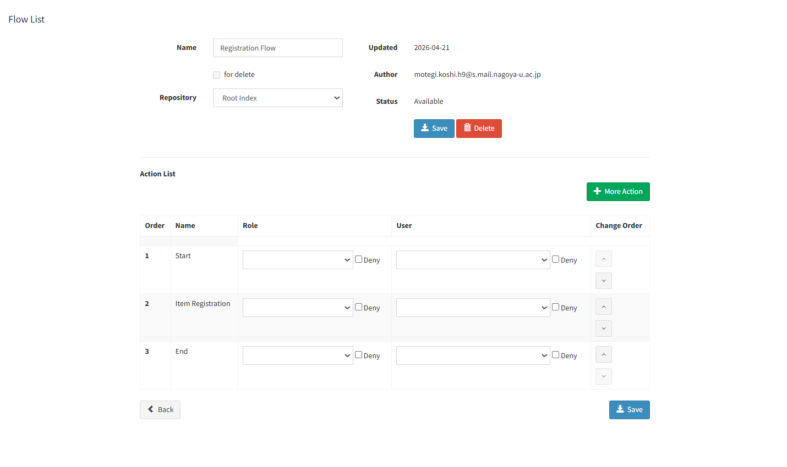

# weko3-metadata-registrar

WEKOのItem TypeエクスポートとCSV/TSV形式のソースデータから、メタデータ一括登録用のTSVまたはZIPを生成し、SeleniumでWEKOへ登録するツールです。

## 0. 利用の流れ

0. Item Typeの項目名に合わせたCSV/TSVを準備する
1. 初期設定を行う
2. WEKOインポート用ZIPを生成する
3. 生成したZIPをSeleniumでWEKOへ登録する

コマンドは、特に記載がない限りリポジトリルートで実行します。

(0のファイルは各自でメタデータを収集してください。形式は[サンプルファイル](./sample/sourcedata_sample.tsv)をご参照ください。)


## 1. 初期設定

### 前提条件

- Python 3.13
- [uv](https://docs.astral.sh/uv/)
- Google Chrome（Selenium登録を行う場合）
- Item TypeをエクスポートできるWEKO環境と権限
  - (GitHub上で公開されている[WEKO3](https://github.com/RCOSDP/weko.git) 2.0.0で動作を確認しています。JAIRO Cloudや他のバージョンでの動作は確認していません。)


依存パッケージをインストールします。

```shell
uv sync
```

### Item Type の設定（インポート・エクスポート）

WEKO内でAdministration > Item Types > Metadataに移動し、Item Typeを設定してください。

同梱の `sample/config/ItemType_export_sample.zip` は設定例です。WEKOにインポートして、設定ファイルとして利用できます。


別の項目を設定する場合は、Item Typeの設定を行ったうえで、sample/configのZIPファイルをエクスポートしたZIPへ置き換えてください。（あるいは、configの中で、参照先のファイルパスを変更してください。）


### Index Tree の設定

WEKO内でAdministration > Index Tree > Edit Treeに移動し、Index Treeの設定を行ってください。
（詳細は省略します。公式のドキュメントをご参照ください）

### Workflow の設定

WEKO内でAdministration >  WorkFlow > FlowList・WorkFlow Listに移動し、WorkFlowを設定してください。
以下が設定例です。



### 設定

[config/metadata_registration.json](config/metadata_registration.json) に、対象WEKOとItem Typeに対応する値を設定します。

```json
{
  "weko_base_url": "https://weko.example.org",
  "item_type_export": "../sample/config/ItemType_export_sample.zip",
  "indexes": {
    "Example": "1234567890"
  },
  "default_index": "Example",
  "publish_date": "2025-05-27",
  "default_languages": {
    "Title": "en",
    "Title_g": "en"
  }
}
```

| キー | 必須 | 用途 |
|---|---:|---|
| `weko_base_url` | 必須 | Item Schema URLの生成とSelenium登録先の既定値 |
| `item_type_export` | 必須 | WEKOからエクスポートしたItem Type のZIPファイルへのパス |
| `indexes` | 必須 | Index名をキー、IndexIDを値とする対応表 |
| `default_index` | 必須 | `--index-name`（後述） を省略した場合に使用するIndex名 |
| `publish_date` | 必須 | `--publish-date`（後述） を省略した場合に使用する公開日。`2025-05-27` のようにゼロ埋めした `YYYY-MM-DD` 形式の実在する日付で指定する（それ以外は設定エラー） |
| `default_languages` | 必須 | 言語子項目（`*_language`）を持つ項目の既定の言語コード（例: `en`）を、入力列名ごとに指定するオブジェクト。行ごとの言語は入力の `<列名>_lang` 列で上書きできる（後述）。タイトル項目のいずれにも、ここにも入力の `<列名>_lang` 列にも言語がなければ生成を停止する |

`Index` はメタデータの登録先となるWEKO上のコレクションです。対象WEKOのIndex管理画面で登録先のIndex名とIndexIDを確認し、`indexes` に設定してください。
（メタデータの登録結果（[例](./sample/ResearchArtifact(40001).tsv)や、ワークフローの設定画面から確認できます）

`item_type_export` の相対パスは、`metadata_registration.json` があるディレクトリを基準に解決されます。`default_index` には、`indexes` に存在する名前を指定してください。

### 認証情報

Selenium登録を行う場合は、`.env.sample` をリポジトリルートの `.env` へコピーします。

macOS/Linux:

```shell
cp .env.sample .env
```

PowerShell:

```powershell
Copy-Item .env.sample .env
```

`.env` の値を対象WEKOのアカウントに変更します。

```dotenv
WEKO_EMAIL=<login-email>
WEKO_PASSWORD=<login-password>
```

### 入力CSV/TSV

入力ファイルの列名は、Item Type ZIP内のメタデータ項目名と一致させます。列名は重複させないでください。同じ列名が複数あるとエラーになります。複数の値は、同名の列を並べずに1つのセルへリストとして記述します。次の例は、同梱されているサンプルItem Typeに対応するもので、すべてのItem Typeに共通する列名ではありません。

```csv
corpusid,Title,Title_g,Creator,PublicationYear_g
123,Main title,Alternative title,"['Alice', 'Bob']",2026-08-23T12:34:56
```

複数の値を持つ項目は、`"['Alice', 'Bob']"` のように各要素を引用符で囲んだPython形式のリストで記述します。リストとして解釈されるのは、前後の空白を除いた値が `[` で始まり `]` で終わるセルだけです。それ以外のセル（例: `1.50`、`0x1F`、`None`、`1, 2`）は文字列としてそのまま扱われます。`[draft] Title` のようにリストとして解釈できない値も、そのまま1つの文字列になります。リストの要素に文字列以外の値（例: `[1.50]`、`[['a', 'b']]`）を含めるとエラーになるため、`"['1.50']"` のように各要素を文字列として記述してください。仕様として、すべてのセルの値とリストの各要素について、前後の空白（半角・全角スペース、タブ、改行、NBSPなど）は取り除かれます。値の途中の空白や改行はそのまま残り、空白だけのセルは空値として扱われます。リストの要素のうち `None`、空文字（`''`）、空白だけの要素は取り除かれます。たとえば `"['a', '', ' ', 'b']"` は `a` と `b` の2要素になり、`"[None]"` や `"['']"` は空のセルと同じ扱いになるため、必須（`Required`）の項目では行単位のエラーになります。複数の値を持てるのは、Item Typeで配列（`array`）型の項目です（サンプルでは `Title`、`Creator`、`Contributor`、`Subject`、`Description`）。これらの項目は値ごとに `Title[0]`、`Title[1]` ... のように列が展開されます。配列型でない項目（サンプルでは `Title_g` など）にリストを記述した場合、空でない要素が1つだけなら値として使われますが、2つ以上あると行単位のエラー（`'<列名>' accepts a single value but got N`）になります。

日付の列（Item Typeで日付入力の項目）は、`T` 以降を取り除き、前後の空白を除いたうえで、`YYYY-MM-DD`、`YYYY-MM`、`YYYY` のいずれかの形式であることを検査します（例: `2020-01-02T10:00:00` や ` 2020-01-02 ` は `2020-01-02` になります）。月・日はゼロ埋めが必要で、`2020-1-2`、`2020/01/02`、存在しない日付（`2020-02-30`、`2020-13`）は行単位のエラー（`'<列名>' value '<値>' is not a WEKO date ...`）になります。この検査はWEKO自身の日付検証ルール（weko-search-ui の `validation_date_property`）と同じですが、WEKOがこのルールを適用するのは一部の日付項目だけです。そのため、WEKOでは受け付けられる、または変換される値（例: `YYYY/MM/DD`）も、このツールではエラーになることがあります。

ヘッダーにItem Typeの項目名と一致しない列があると、`warning: <path>:1: unknown column 'Titel' (did you mean 'Title'?) will be ignored` のように警告し、その列を無視して生成します。入力にない項目の中に似た項目名がある場合（大文字小文字や前後の空白の違いを含む）は候補を表示します。Item Typeの項目に対応する列が入力にない場合は `warning: <path>:1: missing column 'X'` と警告し、必須項目では末尾に `(Required)` を付けます（必須項目の列がない場合は、各行も必須項目が空のエラーになります）。Item Typeにない識別用の列などを意図して含めている場合、この警告は無視して構いません。`--strict-columns` を指定すると、未知の列があるときは警告ではなく、すべての未知の列を列挙して生成を停止します（不足している列は引き続き警告のみです）。`invalid_rows.tsv` の `_invalid_row` と `_invalid_reason` の列と、列名が空の列（pandasで保存したCSVのインデックス列など）は未知の列として扱わず、警告もエラーも出しません。

言語子項目（`*_language`）を持つ項目（サンプルでは `Title` と `Title_g`）は、入力に `<列名>_lang` 列（例: `Title_lang`、`Title_g_lang`）を追加すると、行ごとに言語コード（例: `ja`、`en`）を指定できます。各行の言語は、`<列名>_lang` 列のセルが空でなければその値、空なら `default_languages` のその列名の値、どちらもなければ空になります。複数の値を持つ項目では、`Title` に `"['T1', 'T2']"`、`Title_lang` に `"['ja', 'en']"` のように値と同じ順・同じ数の言語をリストで指定すると、`T1` に `ja`、`T2` に `en` が対応します。`ja` や `"['ja']"` のように言語を1つだけ指定した場合と、`default_languages` を使う場合は、その言語がすべての値に適用されます。値のリストと言語のリストはどちらも空の要素を取り除いてから、空でない値に順に対応付けられます（たとえば `Title` が `"['T1', '', 'T2']"`、`Title_lang` が `"['ja', 'fr', 'en']"` の場合は値2つに言語3つとなります）。言語の数が1つでも値の数とも一致しない場合は行単位のエラー（`'<列名>_lang' has N languages but '<列名>' has M value(s) ...`）になります。言語は値が空でない要素にだけ出力されます。言語コードの妥当性はこのツールでは検査しないため、WEKOが受け付けないコードはインポート時に拒否されることがあります。`<列名>_lang` 列は言語子項目を持つ項目についてだけ既知の列として扱い、それ以外の項目の `_lang` 列は未知の列として警告されます。Item Typeに `<列名>_lang` と同じ名前の項目があると区別できないため、生成はエラーで停止します。

WEKOは、JPCOARのタイトル（`title`、言語属性付き）にマッピングされた非表示（`Hide`）でない項目のいずれにも値と言語の組が1つもないレコードを `Title is required item.` として取り込みません。このツールはItem Type ZIP内の `ItemTypeMapping.json` の `jpcoar_mapping` からタイトル項目を判定し（このファイルがない場合はタイトル項目なしとして扱います）、非表示のタイトル項目は判定から除きます。タイトル項目がすべて非表示の場合と、どのタイトル項目も `default_languages` にも入力の `<列名>_lang` 列にも言語がない場合は、行を読む前に生成を停止します。値と言語の組を持つタイトル項目が1つもない行は行単位のエラー（`no title field (...) has both a value and a language ...`）になります。言語がどちらにもない項目（タイトル項目の一部を含む）は、その列が入力にあれば `warning: <path>:1: field 'X' has no language ...` と警告し、言語を空のまま生成します。

出力TSVの1つのセルに入る値は131,072文字までです。WEKOはTSVの読み込み時にこれより長いセルを受け付けず、そのTSVのすべてのレコードが取り込めなくなるためです。リストの場合は要素ごとに数えます。この上限を超える値があると、生成はファイル名・行番号・列名を表示して停止します。行単位のエラー（`path:行番号:` 形式）の行番号はヘッダーを1行目として数えたレコード番号で、セル内に改行がある場合は物理的な行番号と一致しないことがあります。CSV/TSVとして読み取れない入力のエラー（`path: line N:` 形式）には物理的な行番号が表示されます。

サンプルファイルは[こちら](./sample/sourcedata_sample.tsv)

## メタデータファイルの生成

### 基本コマンド

次の例では、50レコードごとに分割したWEKOインポート用ZIPを `output/zip_data` へ生成します。

```shell
uv run python src/scripts/generate_metadata_imports.py \
  --input path/to/input.csv \
  --output-dir output/zip_data \
  --chunk-size 50 \
  --zip
```

### 生成コマンドの引数

| 引数 | 必須 | 既定値 | 説明 |
|---|---:|---|---|
| `--input PATH` | 必須 | なし | ソースCSV/TSV |
| `--delimiter {auto,comma,tab}` | 任意 | `auto` | 入力ファイルの区切り文字。`comma` はカンマ、`tab` はタブ |
| `--output-dir PATH` | 必須 | なし | 生成ファイルの出力先 |
| `--registration-config PATH` | 任意 | `config/metadata_registration.json` | 登録設定JSON |
| `--index-name NAME` | 任意 | 設定の `default_index` | 使用するIndex名。IndexIDは `indexes` から解決する |
| `--publish-date YYYY-MM-DD` | 任意 | 設定の `publish_date` | 公開日を一時的に上書きする。`YYYY-MM-DD` 形式の実在する日付でない場合はエラー |
| `--chunk-size N` | 任意 | `0` | 1ファイル当たりのレコード数。`0` は分割しない |
| `--zip` | 任意 | 無効 | TSVに加えて登録用ZIPを生成する |
| `--keep-tsv` | 任意 | 無効 | `--zip` 使用時もZIP化前のTSVを残す |
| `--overwrite` | 任意 | 無効 | 出力先にある既存の生成ファイルをすべて削除してから生成する |
| `--skip-invalid-rows` | 任意 | 無効 | エラーのある行を除外して生成し、除外した行を `invalid_rows.tsv` に出力する |
| `--strict-columns` | 任意 | 無効 | Item Typeにない列が入力にある場合、警告ではなくエラーとして停止する |

`--delimiter auto` では、拡張子が `.tsv` ならタブ、`.csv` ならカンマとして読み込みます。それ以外の拡張子（`.txt` や拡張子なしなど）では、ヘッダー行（1行目）のタブとカンマの数で判定し、タブの方が多ければタブ、それ以外はカンマとして扱います。ヘッダーにItem Typeの項目名と一致する列が1つもない場合は、区切り文字の誤りとみなして生成を停止します。拡張子と実際の区切り文字が異なるファイル（例: タブ区切りの `.csv`）は `--delimiter tab` のように明示してください。

`--zip` を指定しない場合はTSVだけを生成し、TSVは常に残ります。`--zip` を指定して `--keep-tsv` を指定しない場合、TSVはZIPへ格納した後に削除されます。

行単位のエラー（必須項目が空、リストの要素が文字列でない、日付の形式が不正、セルが長すぎるなど）がある場合、既定では入力全体を検査してエラーのある行をすべて `path:行番号: 内容` の形式で表示し（最大50行。それ以上は `... and N more`）、ファイルを何も書き込まずに停止します。WEKOはインポートファイル内に1件でもチェックエラーのあるレコードがあるとファイル全体を取り込まないため、既定ではすべての行が正しい場合だけ生成します。ヘッダーの誤りやCSV/TSVとして読み取れない入力など、ファイル全体に関わるエラーは最初の1件で停止します。

`--skip-invalid-rows` を指定すると、エラーのない行だけで生成し、除外した行を出力先の `invalid_rows.tsv` に書き出して `skipped <件数> invalid row(s); see <パス>` と表示します。`invalid_rows.tsv` はUTF-8 BOM付きのタブ区切りで、1行目は `_invalid_row`、`_invalid_reason` と入力ファイルの列名、2行目以降は除外した行の行番号、エラー内容、入力されていた元の値です。

除外した行を登録し直すときは、`invalid_rows.tsv` の値を修正し、修正した行だけを入力として再実行してください。元の入力ファイルで再実行すると、生成済みのZIPで登録した行が重複して登録されます。`invalid_rows.tsv` はそのまま `--input` に指定できます（`_invalid_row` と `_invalid_reason` の列は生成時に無視されます）。出力先に前回の `invalid_rows.tsv` が残っていると生成は停止するため、移動・削除するか `--overwrite` を指定してください。`--input` に指定したファイルは、出力先にあっても `--overwrite` で削除されません。ただし修正後もエラーが残る行がある場合、そのファイルは新しい `invalid_rows.tsv` で上書きされます。

エラーのある行がない場合、`invalid_rows.tsv` は作成されません。すべての行にエラーがある場合は `invalid_rows.tsv` だけを書き出し、TSV/ZIPは生成せずに終了コード1で終了します。このとき `--overwrite` を指定していても、前回生成したTSV/ZIPは削除されず、前回の `invalid_rows.tsv` だけが置き換えられます。

`--chunk-size`は一括登録時のエラー回避のためのものです。[v1.0.8の修正](https://nii-auth.atlassian.net/wiki/spaces/JAIROCloudWEKO3/pages/43549582/2025-07-02+v1.0.8)によって改修されたと思われますが、設定する事をお勧めします。

### 出力ファイル

| 条件 | TSV | ZIP |
|---|---|---|
| 分割なし | `output_write.tsv` | `import.zip` |
| 分割あり | `output_write_001.tsv` など | `import_001.zip` など |

`--skip-invalid-rows` で除外した行がある場合は、除外した行の一覧として `invalid_rows.tsv` も出力します。ZIP内ではTSVを `data/output_write[_NNN].tsv` として格納します。入力にレコードがない場合、ファイルは生成されません。生成TSVはWEKOのインポート形式に合わせてUTF-8 BOM付きで出力されます。

出力先ディレクトリの直下に `output_write.tsv`、`output_write_<数字>.tsv`、`import.zip`、`import_<数字>.zip`、`invalid_rows.tsv` のいずれかが既にある場合、既定では何も書き込まずにエラーで停止します。前回の生成ファイルを移動するか登録してから再実行してください。`--overwrite` を指定すると、これらの既存ファイルを分割数にかかわらずすべて削除してから生成し、削除したファイルを `removed <パス>` として表示します。まだWEKOに登録していないZIPも削除されるため注意してください。入力の読み込みでエラーになって停止した場合や入力にレコードがない場合は、既存ファイルを削除しません。それ以外のファイルやサブディレクトリは対象外です。ファイル名の大文字・小文字は区別しません（例: `IMPORT.ZIP` も対象）。

`--overwrite` は新しいファイルを書き込む前に既存ファイルを削除します。削除後の書き込みに失敗した場合（ディスク容量不足、ファイルのロックなど）、出力先には前回のファイルが残らないことがあります。

出力先にある上記以外のZIP（例: `manual.zip`）は削除も停止の対象にもならず、生成後に `warning: <パス> is not a generated file ...` と警告を表示するだけです。登録処理は `--zip-dir` 内のすべての `*.zip` を登録対象にするため、その出力先を `--zip-dir` として使う場合は事前に移動してください。

登録時に `--keep-zip-after-import` を指定するとZIPが `output/zip_data` に残るため、同じ出力先へ再生成するには `--overwrite` が必要です。


## WEKOへの登録

### 登録前の確認

- `.env` の `WEKO_EMAIL` と `WEKO_PASSWORD` が対象環境の値である
- `output/zip_data` に今回登録するZIPだけが置かれている

生成時のItem Schema URLには、登録設定の `weko_base_url` が常に使われます。一方、Seleniumの登録先URLは次の優先順位で決まります。

```text
--weko-base-url
  > 実行プロセスの環境変数 WEKO_URL
  > .env の WEKO_URL
  > metadata_registration.json の weko_base_url
```

CLIまたは `.env` でURLを上書きする場合は、生成時と登録時が異なるWEKO環境になっていないことを確認してください。

### 基本コマンド

Chromeを表示して登録します。

```shell
uv run python src/scripts/selenium_auto_register.py
```

Chromeを画面に表示せず実行する場合は、`--headless` を指定します。

```shell
uv run python src/scripts/selenium_auto_register.py --headless
```

既定では `output/zip_data` 内のすべてのZIPをファイル名順に登録します。

### 登録コマンドの引数

| 引数 | 既定値 | 説明 |
|---|---|---|
| `--base-dir PATH` | リポジトリルート | `.env` と既定入出力ディレクトリの基準 |
| `--weko-base-url URL` | 環境変数、`.env`、または登録設定 | Seleniumの登録先URLを一時的に上書きする |
| `--registration-config PATH` | `config/metadata_registration.json` | 登録設定JSON |
| `--selector-config PATH` | `config/weko_ui_selectors.json` | WEKO画面のUIセレクタ設定 |
| `--zip-dir PATH` | `output/zip_data` | 登録対象ZIPのディレクトリ |
| `--download-dir PATH` | `output/import_results` | WEKOから取得するインポート結果の保存先 |
| `--processed-zip-dir PATH` | `output/uploaded_zip_data` | 登録済みZIPの移動先 |
| `--headless` | 無効 | Chromeを画面に表示せず実行する |
| `--limit N` | 制限なし | ファイル名順の先頭N件だけ登録する |
| `--keep-zip-after-import` | 無効 | 登録済みZIPを元の場所に残す |
| `--delete-zip-after-import` | 無効 | 登録成功後のZIPを削除する |

`--zip-dir`、`--download-dir`、`--processed-zip-dir` の既定値は、`--base-dir` を基準に解決されます。明示的に指定したパスは、実行時のカレントディレクトリを基準に解決されます。

### タイムアウト引数

すべてミリ秒単位です。

| 引数 | 既定値 | 対象 |
|---|---:|---|
| `--ui-timeout-ms` | `45000` | 入力欄やボタンなど、個々のUI要素の待機 |
| `--post-login-timeout-ms` | `45000` | ログイン完了の待機 |
| `--load-timeout-ms` | `240000` | ZIP読込みとインポートボタン有効化の待機 |
| `--import-timeout-ms` | `480000` | インポート完了の待機 |
| `--download-timeout-ms` | `120000` | 結果ファイルのダウンロード完了待機 |

WebDriverの切断と判定された場合に限り、1ファイルにつき最大4回試行します。その他のエラーでは処理を中断し、未処理のZIPはそのまま残ります。

### 登録後のファイル

登録に成功すると、WEKOからダウンロードした結果ファイルを `output/import_results` に保存します。登録対象ZIPは、指定したオプションに応じて次のように処理します。

| オプション | 登録成功後のZIP |
|---|---|
| どちらも指定しない | `output/uploaded_zip_data` へ移動 |
| `--keep-zip-after-import` | 元のディレクトリに残す |
| `--delete-zip-after-import` | 削除する |

`--delete-zip-after-import` による削除は元に戻せません。`--keep-zip-after-import` と同時に指定しないでください。両方を指定した場合、現行実装では削除が優先されます。

コンソールに `imported=<zip-path> result=<download-path>` が表示され、結果ファイルが保存されていることを確認してください。登録対象がない場合は `No zip files were found to import.` と表示して終了します。

## 生成物の仕様

### WEKOインポート制御列

Item Typeのメタデータ項目ではない制御列は、次の方針で生成します。

| 列 | 登録値 | 属性 |
|---|---|---|
| `#ID`, `URI` | 空欄 | WEKOインポート形式の固定値 |
| `.IndexID[0]`, `.POS_INDEX[0]` | `indexes` / 選択したIndex名 | `Allow Multiple` |
| `.PUBLISH_STATUS` | `public` | `Required` |
| `.FEEDBACK_MAIL[0]`, `.RESEAECHMAP_LINKAGE`, `.CNRI`, `.DOI_RA`, `.DOI` | 空欄 | WEKOインポート形式の固定値 |
| `Keep/Upgrade Version` | `keep` | `Required` |
| `PubDate` | `publish_date` | Item Type ZIPの `render.meta_fix.pubdate.option` から取得した属性 |

## 関連論文等

本レポジトリのコードは、以下の論文におけるメタデータの収載に用いたものです。
```bibtex
@article{axies2025,
  title   = {研究データのオープンアクセスを加速化する：生成AIを用いたメタデータ生成と機関リポジトリへの収載},
  author  = {渡邉 優 and 茂木 光志 and 松原 茂樹},
  journal = {大学ICT推進協議会年次大会論文集},
  volume  = {2025},
  number  = {},
  pages   = {702-708},
  year    = {2025},
  doi     = {10.24669/axies.2025.0\_702}
}
```

収載されたメタデータは以下で公開されています。
[https://scholar.jp](https://scholar.jp)